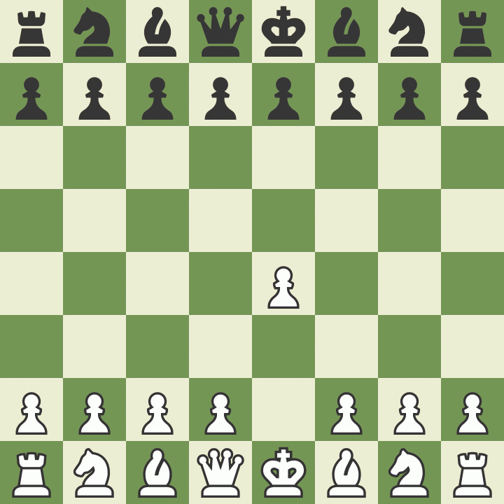

<h1 class="title">NarChesser - A transformer based chess engine</h1>

        
**Credits:**

Move generation: [https://disservin.github.io/chess-library/](url)

Inspiration: AlphaZero - [https://arxiv.org/abs/1712.01815](url), Leela Chess Zero - [https://github.com/LeelaChessZero/](url)

**Instructions:**

-Download CUDA 12.1 and 11.8

-Download Libtorch Debug version and place "libtorch" folder inside the same directory as NarChesser

-After Compiling with MSVC place the params.txt in the Debug folder

-Inside the params.txt change the model directory to the directory outside the folders where each of your models are located

-Folder with model should be named current_model, while adding an old_model directory is optional

</body>

**Playing Black**

